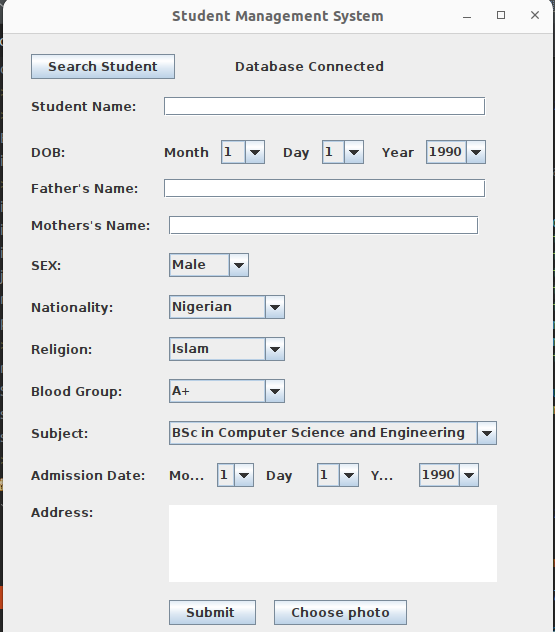
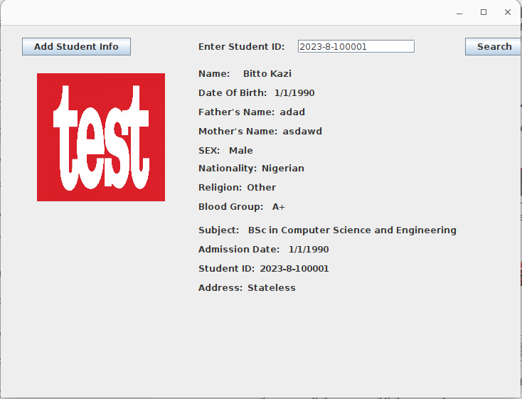
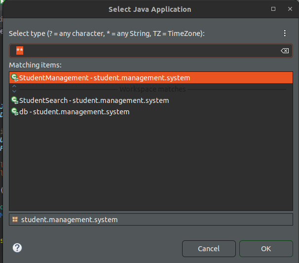
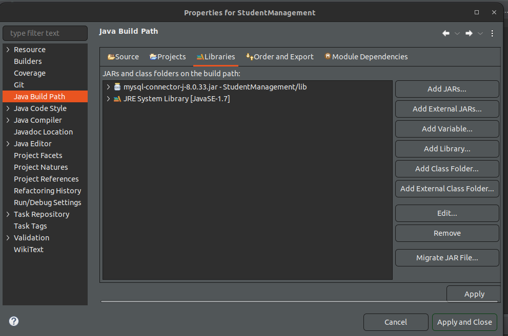

# Student Management System Desktop Application JAVA using Eclipse IDE

Student Management System Desktop Application JAVA using Eclipse IDE.

Student management system is an environment where all the process of the student in the institution is managed. It is done through the automated.

Write a program to build a simple Software for Student Information Management System which can perform the following operations:
Store the First name of the student.
Store the Last name of the student.
Store the unique Roll number for every student.
Store the CGPA of every student so on....

## Screenshots

## Requirements

- Eclipse IDE
- Mysql 8 database

# How to run the application

**First import the project into Eclipse. Do not worry about errors right now.**

## Database Config

Mysql 8 database is required for the application.
**_If you have mysql database already installed follow the below instruction:_**

- Create a database named **smsdb**
- import **smsdb.sql** into the **smsdb** database
- Configure **db.java** class with your database connection parameters

Database configuration Instructions images:

**If you do not have mysql database you can install it on your computer by yourself** or you can use the below instruction to install it with docker:

- Install **docker** and **docker-compose** for your OS
- goto project root directory and run the command using **command prompt** or terminal: **docker-compose up -d**
- You are all done.

If you used docker to install database then you can go to http://localhost:8181 from browser to see all databases.

## Running the application

Select the project in eclipse and _Run as_ **Java Application**

### If error occurred during running the application

Please add this file **/lib/mysql-connector-j-8.0.33.jar** into the **Build Path** if the application is not running. Add it like below:

